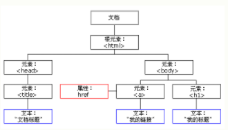

# DOM  页面加载时，浏览器会创建页面的文档对象模型（Document Objective Model)
HTML DOM 模型被构造为对象的树

## DOM的作用，通过可编程的DOM,js有足够的能力来创建动态的HTML
1、js改变页面中的HTML元素
2、改变页面中的HTML属性
3、改变页面中的CSS样式
4、对事件作出反应
5、添加、删除HTML标签
## 查抄HTML元素
通过id找到HTML元素
var x=document.getElementByID("demo")
通过标签名找到HTML元素
var x=document.getElementById("demo")
var y=x.getElementsByTagName("p")
通过类名找到HTML元素(在IE5，6，7，8中无效)
## HTML DOM使javascript有能力对HTML事件作出反应
<h1 onclick="this.innerHTML='谢谢！'">请点击该文本</h1>   

### HTML DOM允许js来向HTML元素分配事件：

## 事件类型
onload和onunload用户进入或离开页面被触发
onchange
<input type="text" id="fname" onchange="upperCase()">
onmouseover鼠标经过onmouseout鼠标离开
onclick完成鼠标点击
## DOM元素（节点）
### 添加HTML元素：首先要创建该元素，然后向已经存在的元素追加该元素

这是一个段落

这是另一个段落
 

### 删除HTML元素，必须首先获得该元素的父元素

这是一个段落

这是另一个段落
 

